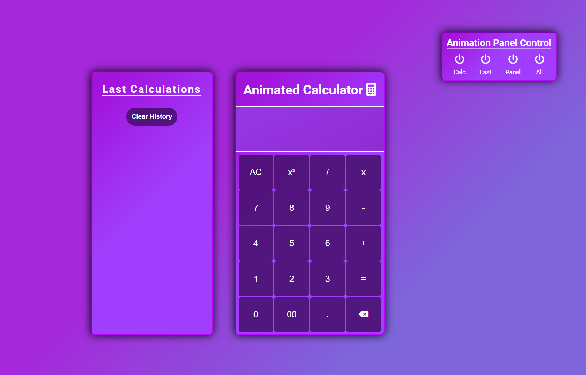
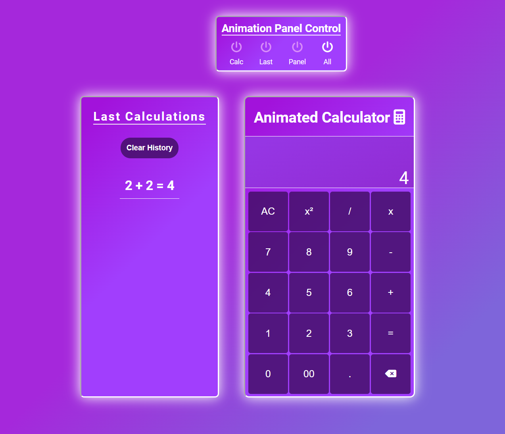

# Animated Calculator

**Hello!**

This is my first application that I have created on my own.

It is a simple calculator on which you can perform operations.
**What makes my calculator different from others** is that, using a panel of buttons, you can **activate the animation of the calculator** as well as the other two panels. **Such visual variety :)**

Once the page has loaded, you will be greeted with information on how to use the application.
You can complete the data for the calculator using the mouse by clicking on the appropriate button.
Typing digits into the calculator using the keyboard works, but to perform an operation, after typing a digit you must click on the appropriate operator for example. +, = etc.
In the future I will want to write a function so that actions are also possible 100% via the keyboard.

## Screenshots

## 🔗 Live Site
[Live Site Here!](https://camillematernacci.github.io/Animated-Calculator/)

## 🛠 Technologies used

     

